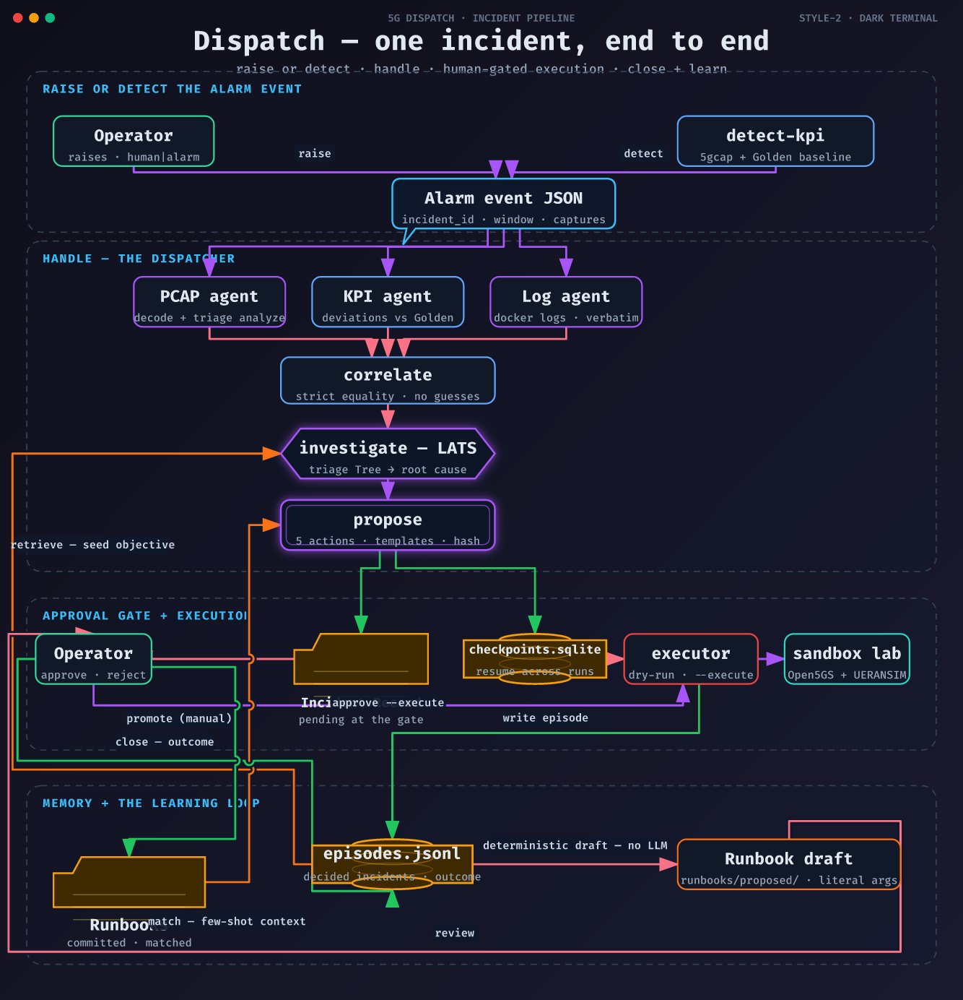

# dispatch

Event-driven incident orchestration for the 5G_PCAP stack. An Alarm
event — raised by a human or synthesized from KPI degradation — flows
through the Dispatcher, which fans out to the three specialist evidence
agents (PCAP, Log, KPI), correlates their findings, runs a root-cause
investigation, proposes a remediation from a fixed action vocabulary,
and gates execution on Human approval. Nothing executes without it.

Glossary: [`CONTEXT.md`](./CONTEXT.md) · architecture:
[`docs/adr/0001-incident-orchestration.md`](./docs/adr/0001-incident-orchestration.md) ·
remediation safety:
[`docs/adr/0002-remediation-proposal-and-executor.md`](./docs/adr/0002-remediation-proposal-and-executor.md) ·
memory and learning:
[`docs/adr/0003-structured-memory-and-gated-learning.md`](./docs/adr/0003-structured-memory-and-gated-learning.md)

## The workflow

Five subcommands, one artifact — the Incident Record. A complete real
run is committed at
[`docs/sample-incident-record.md`](./docs/sample-incident-record.md).

### 1. `detect-kpi` — the Alarm event

The KPI-degradation comparator runs 5gcap over the captures and compares
the computed KPIs against the committed Golden baseline: a procedure
success-rate drop, a latency KPI above twice golden, or any cause-bearing
reject across NAS/PFCP/SBI synthesizes the event JSON. Healthy KPIs print
nothing (exit 0) — no event.

```
uv run dispatch detect-kpi ../5gcap/tests/fixtures/n4_upf_timeout.pcap \
  --sbi ../5gcap/tests/fixtures/n4_upf_timeout_sbi.pcap \
  --n4 ../5gcap/tests/fixtures/n4_upf_timeout_n4.pcap > event.json
```

A human can also raise the event by hand — `source` may be `kpi`,
`alarm`, or `human` (the shape is in [`CONTEXT.md`](./CONTEXT.md)):

```
{
  "incident_id": "inc-human-12345678",
  "detected_at": 1788000000.0,
  "source": "human",
  "procedure": "pdu_session_establishment",
  "time_window": {"start": 1787999400.0, "end": 1788000000.0},
  "description": "Operator report: PDU session establishment failing on the lab core",
  "kpi": null,
  "captures": {
    "n2": "../5gcap/tests/fixtures/n4_upf_timeout.pcap",
    "sbi": "../5gcap/tests/fixtures/n4_upf_timeout_sbi.pcap",
    "n4": "../5gcap/tests/fixtures/n4_upf_timeout_n4.pcap"
  }
}
```

### 2. `handle` — the investigation

```
uv run dispatch handle event.json --stub stub.json
```

The stub seeds the record with placeholder evidence that the specialists
replace; an honest empty stub is just `{"evidence": []}`. The pipeline:

- **PCAP agent** — 5gcap decodes the event's captures and a
  `triage analyze` run analyzes the export; only findings with decode
  citations (e.g. `flow:1:13`) are recorded.
- **Log agent** — docker stdout logs for the event's time window, LLM
  extraction with a code-enforced exact-log-line grounding check.
- **KPI agent** — deterministic 5gcap analysis compared against the
  Golden baseline.
- **Correlation graph** — the findings linked into one picture.
- **Root-cause investigation** — a LATS search (triage's Tree) over the
  grounded evidence.
- **Proposal** — the LLM selects one action from the fixed five-action
  vocabulary and drafts a justification; the commands are rendered by
  deterministic templates, never LLM text.

The pipeline **stops at the approval gate**: the record ends
`**pending**`, nothing has executed. The record lands in
`dispatch/records/<incident_id>.md` and the checkpoint in
`dispatch/state/checkpoints.sqlite` (both gitignored runtime artifacts).
A duplicate incident is refused.

### 3. `approve` / `reject` — the Human decision

```
uv run dispatch approve <incident_id>              # dry-run: renders the commands
uv run dispatch approve <incident_id> --execute    # applies them to the sandbox
uv run dispatch reject <incident_id>               # records the rejection
```

Approval and rejection resume from the checkpoint store in fresh
invocations. The proposal hash recorded at handle time gates the whole
decision path — a tampered record refuses to be approved or rejected.
The bare `approve` is a dry-run in the execution sense only: it renders
the commands and records the approval on the Incident Record without
touching the sandbox; only `--execute` applies them. An incident is
decided once — a second `approve` or `reject` on the same record is
refused. A record that honestly produced no proposal cannot be approved
(the CLI says so and exits 1); `reject` is the way to close it.

### The action vocabulary (ADR-0002)

| action | args | effect |
|---|---|---|
| `restart_nf` | `{"nf": "<core service>"}` | restarts one sandbox core NF |
| `revert_config` | `{"path": "<config file under the sandbox>"}` | reverts a config file |
| `reseed_subscriber` | `{"imsi": "<14–15 digit IMSI>"}` | re-provisions a subscriber |
| `rerun_capture` | `{"scenario": "<one of the nine>"}` | re-runs a failure-injection capture |
| `observe_only` | `{}` | records the incident, applies nothing |

The nine `rerun_capture` scenarios (see
[`../sandbox/README.md`](../sandbox/README.md)): `auth_failure`,
`registration_reject`, `registration_timeout`,
`pdu_session_reject_slice`, `pdu_session_reject_other`,
`pdu_session_timeout`, `sbi_udm_timeout`, `sbi_nssf_reject`,
`n4_upf_timeout`.

### 4. `close` — the Outcome and the learning loop

```
uv run dispatch close <incident_id> --outcome resolved --evidence "detect-kpi returned the Golden baseline"
uv run dispatch close <incident_id> --outcome unresolved
```

`close` is valid only for **approved-executed** incidents — pending,
dry-run-approved, rejected, and already-closed incidents are refused. It
appends an **Outcome** section to the Incident Record (verdict, operator
evidence, and a suggested confirmation check — the same Golden-baseline
comparison as `detect-kpi`, over fresh post-remediation captures) and
updates the incident's **Episode** with the verdict.

When the outcome is `resolved` and the remediation was a real action
(not `observe_only`) that no committed **Runbook** already covers, the
loop stages a **Runbook draft** — deterministic template, no LLM call —
at `dispatch/runbooks/proposed/<procedure>-<incident_id>.md` with the
episode's concrete args copied literally, and prints the diff for review.
Promotion is manual: you review the draft, generalize the args to
`{placeholder}` form where warranted, and move it into
`dispatch/runbooks/`. The loop never edits committed runbooks — learning
never self-applies (ADR-0003).

## Sample Incident Record

[`docs/sample-incident-record.md`](./docs/sample-incident-record.md) is a
real end-to-end `n4_upf_timeout` run: `detect-kpi` over fresh lab
captures, then `handle` with the live specialists, ending pending at the
approval gate. The rendered command's checkout path is normalized
(`/path/to/5G_PCAP`); everything else is byte-faithful, and the proposal
hash still verifies the three proposal fields against the record. One
invisible detail is load-bearing: the proposal justification contains a
narrow no-break space (U+202F) in "NAS cause 38", and the hash covers
it — do not "fix" the typography.

## Preconditions

- The sandbox lab is up and seeded — see
  [`../sandbox/README.md`](../sandbox/README.md) — and the event's
  captures exist.
- `GROQ_API_KEY` is set: the log extraction, the root-cause search and
  the proposal are live Groq calls (ADR-0002: no local model fallback).
- Everything else — 5gcap, the KPI comparator, the templates, the
  record rendering — is deterministic and offline.

## Eval harness

[`evals/README.md`](./evals/README.md) runs all nine failure-injection
scenarios through this exact workflow against the live lab and scores
each pending record with a judge model distinct from the generator.

## Architecture



The diagram's source of truth is
[`docs/diagrams/pipeline.json`](./docs/diagrams/pipeline.json)
(fireworks-tech-graph IR); the render and PNG recipes are in
[`docs/diagrams/README.md`](./docs/diagrams/README.md).

**The spine.** One LangGraph `StateGraph` runs a single deterministic
linear path per incident:

`gather → pcap agent → kpi agent → log agent → correlate → investigate
→ propose → approval interrupt → execute`

`gather` validates the Alarm event and the stub into typed state and
fixes the record path. The three specialist nodes then replace only the
stub evidence items of their own source, so an event handled with a stub
specialist keeps honest placeholder evidence in the record. The graph is
compiled with a sqlite `SqliteSaver` checkpointer keyed by
`incident_id` — that is the whole resume story: `approve` and `reject`
are fresh processes that resume the checkpointed graph at the interrupt.

**Grounding contracts, per specialist.** Each agent can only say what
its source proves:

- **PCAP agent** — 5gcap decodes the event's captures and a
  `triage analyze` run analyzes the export; every finding carries a
  decode citation (e.g. `flow:1:13`), and findings without one are
  dropped.
- **Log agent** — docker stdout logs for the event's window, LLM
  extraction with a code-enforced exact-log-line check: every citation
  must be a verbatim log line or the finding is dropped.
- **KPI agent** — deterministic 5gcap KPI computation compared against
  the committed Golden baseline; computed values only, no free text.

**Correlation.** `link()` joins the three evidence sources strictly by
shared key equality: items sharing a key value inside the event's time
window (the window is candidate scope, never a link predicate) become
links, ordered by evidence index. A key value identifying more than two
items is ambiguous and links nothing, and two items that disagree on a
shared key never link — the pipeline never guesses a join.

**Root-cause investigation.** A LATS search over the correlated
inventory — triage's `Tree` imported as a library — replaces the stub's
narrative with a grounded root cause.

**Proposal and executor.** The proposer selects one action from the
fixed five-action vocabulary and drafts a justification; the Executor
renders the commands from deterministic templates, and its render rail
rejects unknown NFs, path escapes, bad IMSIs and unknown scenarios — an
invalid selection yields no proposal, and the record says so honestly.
The proposal hash over the three proposal fields is written into the
record at handle time.

**The approval gate.** `approval` is a LangGraph `interrupt`: the
pipeline stops with the record marked **pending** and nothing executed.
On resume the `execute` node first re-checks the record's hash (a
tampered record refuses to run), records a rejection without touching
the sandbox, or renders/applies the commands — dry-run unless
`--execute`.

**Offline posture (ADR-0002).** Every live default sits behind a seam —
the 5gcap and triage subprocesses, the docker logs call, the log
extraction, the root-cause search and the proposal selection — and the
test suite injects stubs through those seams, so pytest never builds the
Groq predictor and never costs a call. The only live LLM calls are lazy
and key-guarded: the log extraction, the root-cause search, the
proposal.

**Runtime artifacts.** The Incident Record lands in
`dispatch/records/<incident_id>.md`, the checkpoint store in
`dispatch/state/checkpoints.sqlite`, the Episode store in
`dispatch/state/episodes.jsonl`, and close-time drafts in
`dispatch/runbooks/proposed/` — all gitignored and regenerable per
incident (the committed `dispatch/runbooks/*.md` are source, not
runtime data).

**Memory stage (ADR-0003).** Two structured stores, both plain file I/O
— no embeddings, no API calls, so the offline posture holds.

- **Episodes** (`dispatch/state/episodes.jsonl`, append-only) — every
  decided incident is written at decision time, whatever the decision:
  the signature (procedure, evidence keys), the action and its concrete
  args, the root-cause narrative, the decision, and later the Outcome.
  The investigate node scores past Episodes structurally (3 per shared
  cause key, 2 for the same procedure, 1 per shared evidence key;
  threshold 2, top 3, newest first) and seeds the LATS objective with
  the matches — an empty store or nothing relevant changes nothing.
- **Runbooks** (`dispatch/runbooks/*.md`, committed) — operator-authored
  procedural memory with strictly validated YAML frontmatter: one
  resolution `{action, args}` from the vocabulary per file, symptoms as
  key:value match keys. The propose node matches them with the same
  scorer and prepends the top matches as context; `{placeholder}`
  resolution args bind from the incident's evidence keys.
- **The learning loop** — `close` writes the Outcome to the record and
  the Episode, then drafts a Runbook proposal (deterministic, literal
  args, traceable name) into `runbooks/proposed/` for manual promotion.
  The operator is the only writer to the committed library; the loop
  proposes, a human disposes.

- [`docs/adr/0001-incident-orchestration.md`](./docs/adr/0001-incident-orchestration.md)
  — the orchestration decision: the LangGraph spine, the specialist
  fan-out, the correlation of multi-source evidence, the approval gate.
- [`docs/adr/0002-remediation-proposal-and-executor.md`](./docs/adr/0002-remediation-proposal-and-executor.md)
  — the remediation safety decision: the fixed action vocabulary,
  template-rendered commands, the proposal hash, and Human-gated
  execution.
- [`docs/adr/0003-structured-memory-and-gated-learning.md`](./docs/adr/0003-structured-memory-and-gated-learning.md)
  — the memory and learning decision: append-only structured Episodes,
  committed Runbooks, the close-time Outcome, and a draft loop whose
  only writer to committed runbooks is the operator.
