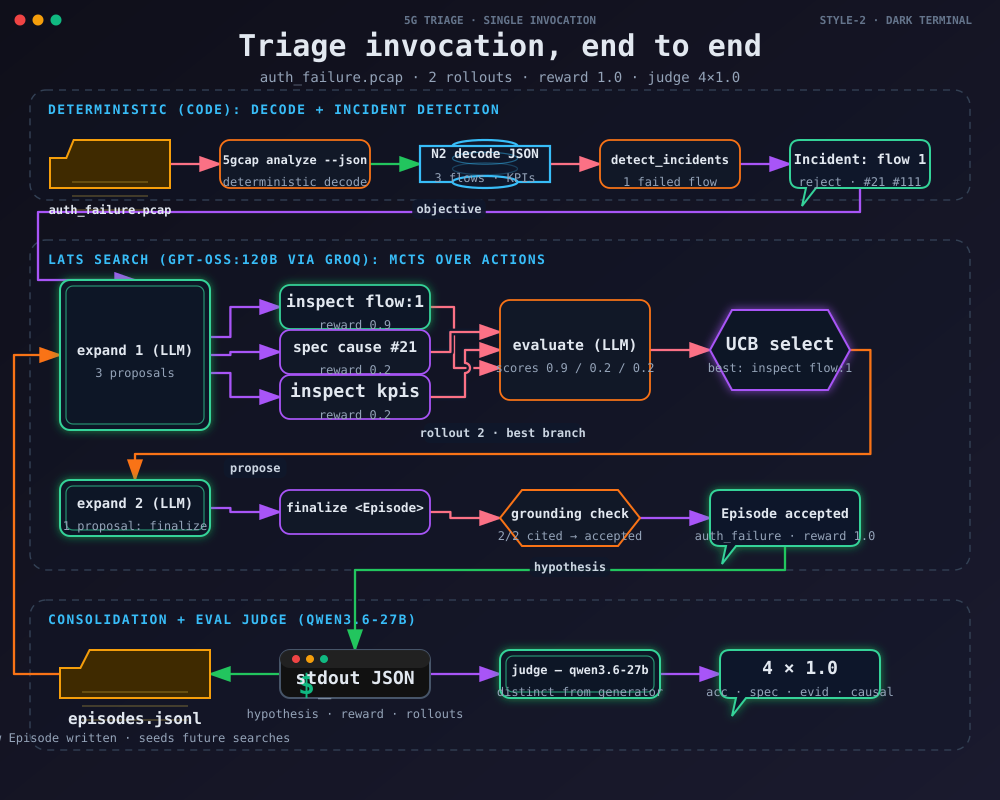

# Triage end to end: one invocation

A single real `triage analyze` run on the `auth_failure` failure-injection
fixture, with every decision the system made, who made it (LLM or code), and
the verdict. Captured live on 2026-08-17; every quote below is verbatim
output from that run. The diagram is in
[`diagrams/invocation-flow.svg`](diagrams/invocation-flow.svg) (source IR:
[`diagrams/invocation-flow.json`](diagrams/invocation-flow.json)).



## The invocation

```
5gcap analyze auth_failure.pcap --json /tmp/auth_failure_n2.json   # decode
triage analyze /tmp/auth_failure_n2.json --verbose                 # triage
```

The decode is deterministic (5gcap). It finds 3 flows; flows 2 and 3 are a
golden attach + PDU session, flow 1 is the injected failure:

```
Flow 1  RAN-UE-NGAP-ID=1 AMF-UE-NGAP-ID=1
      0.378s  InitialUEMessage  NAS: 5GMMRegistrationRequest
      0.389s  DownlinkNASTransport  NAS: 5GMMAuthenticationRequest
      0.390s  UplinkNASTransport  NAS: 5GMMAuthenticationFailure cause=Synch failure
      0.411s  DownlinkNASTransport  NAS: 5GMMRegistrationReject cause=Protocol error, unspecified
      0.413s  UEContextReleaseComplete
  PROCEDURE registration: 5GMMRegistrationRequest -> 5GMMRegistrationReject [reject] 33.8 ms
```

## Stage 1 — incident detection (code)

`detect_incidents` walks the decode with fixed signatures. Flow 1 qualifies
because its Registration procedure outcome is `reject` and it carries
cause-bearing messages (#21, #111); flows 2/3 are skipped because their
procedures are `accept`. The CLI prints one line per detected Incident:

```
[1/1] flow 1 Registration (explicit reject)
```

The Incident becomes the search objective (built in code, not by the LLM).
Before the search starts, the agent queries episodic memory for similar
past incidents (the deterministic retrieval below); this run had an empty
store, so the objective carried no memory context:

> Explain why the Registration procedure failed for flow 1 in this decoded
> 5G capture. Failure shape: explicit reject. Incident detail: cause code(s)
> observed: #21, #111. … Finish with finalize once the evidence supports a
> root cause; its JSON must have incident_type (one of auth_failure,
> registration_reject, …), narrative, and cited_evidence.

### Memory retrieval (code)

Every search is seeded from episodic memory, deterministically: each stored
Episode scores 3 per shared cause code, 1 per shared message name, and 2
for the same procedure; Episodes scoring below 2 are not relevant, and the
top 3 are injected into the objective as context — never as evidence, since
`cited_evidence` must still cite messages decoded in *this* capture. A
second run on the same capture, after the first had consolidated its
Episode, received this objective:

> Past similar incidents retrieved from episodic memory (1 of 1 Episode(s)):
> [1] auth_failure  2026-08-18T09:07:11.739276+00:00
>     Authentication failed due to key synchronization failure, leading to a
>     protocol error reject.
>     cited: 5GMMAuthenticationFailure cause=21; 5GMMRegistrationReject cause=111
> These memory entries are context only: cited_evidence must still cite
> messages decoded in THIS capture.

The `memory` tool remains available for targeted lookups mid-search.

## Stage 2 — LATS search

`run_lats` runs an MCTS tree: `expand → execute → evaluate → backprop`,
repeat, until a node completes. Two LLM steps (gpt-oss:120b via Groq) and one
deterministic step per action. This is the full trace of the run.

### Rollout 1

**expand (LLM)**, at the root with an empty trajectory, proposes 3 branches:

```
inspect flow:1
spec "What does 5GMM Registration Reject cause code #21 represent?"
inspect kpis
```

**execute (code)** dispatches each action deterministically:

- `inspect flow:1` returns the decoded message list for flow 1, including
  `5GMMAuthenticationFailure cause=Synch failure (#21)` and
  `5GMMRegistrationReject cause=Protocol error, unspecified (#111)`, plus the
  reject procedure record.
- `spec …` hits the local 3GPP embedding index (TS 24.501 V19.7.0) with 5
  chunk hits.
- `inspect kpis` returns decode KPIs (`procedure_success_rate=0.800`, …).

**evaluate (LLM)** scores each branch's trajectory:

```
inspect flow:1  -> reward=0.9  incomplete  "…identified an authentication
                    synch failure (cause #21) that triggered a registration
                    reject with protocol error (cause #111)…"
spec cause #21   -> reward=0.2  incomplete  "Only a spec lookup for cause #21
                    was performed, yielding no concrete evidence…"
inspect kpis     -> reward=0.2  incomplete  "…provides no direct evidence
                    linking cause codes #21 or #111 to a specific root-cause…"
```

**backprop (code)** updates each branch's value. Nothing completes: the LLM
only *scores* — a node completes only when a `finalize` action produces an
Episode that validates and grounds (see below).

### Rollout 2

**Selection (code)** — UCB1 picks the best child (`inspect flow:1`, 0.9 vs
0.2/0.2).

**expand (LLM)**, now seeing that branch's trajectory, proposes exactly one
action:

```
finalize {"incident_type":"auth_failure",
  "narrative":"Authentication failed due to key synchronization failure
   (cause 21), leading to a registration reject (cause 111).",
  "cited_evidence":[{"message":"5GMMAuthenticationFailure","cause":21,
   "ts":1786968770.968},
   {"message":"5GMMRegistrationReject","cause":111,"ts":1786968770.989}]}
```

**execute (code)** — the completeness bar, enforced mechanically:

1. Parse + Pydantic-validate the Episode JSON. A malformed finalize is
   rejected with the expected schema echoed back as the observation.
2. Ground the cited evidence: every cited `(message, ts)` must match a
   decoded message within 5e-4 s, and a cited cause must equal the decoded
   one.

```
finalize accepted: hypothesis grounded in 2 evidence item(s).
```

**evaluate (LLM)** scores the completed trajectory `reward=1.0`,
`status=complete`. The tree exits on the first complete node —
`rollouts: 2`. A search that never finalizes runs to `max_rollouts` (10) and
returns no Hypothesis; the CLI reports `no hypothesis` and the harness scores
that run 0.0.

## Stage 3 — consolidation and output (code)

`consolidate` writes the Episode to the episodic-memory store exactly once
(a re-run of the same capture dedups):

```
memory: new Episode written
hypothesis: auth_failure (reward=1.00, rollouts=2)
```

stdout is one JSON array (the CLI's machine contract):

```json
[{
  "flow_id": 1, "procedure": "Registration", "shape": "explicit reject",
  "episode": {
    "incident_type": "auth_failure",
    "narrative": "Authentication synchronization failure caused the UE to send
                  an AuthenticationFailure, which resulted in a
                  RegistrationReject.",
    "cited_evidence": [
      {"message": "5GMMAuthenticationFailure", "cause": 21, "ts": 1786968770.968},
      {"message": "5GMMRegistrationReject",    "cause": 111, "ts": 1786968770.989}
    ]
  },
  "reward": 1.0, "rollouts": 2, "memory_wrote": true
}]
```

## Stage 4 — the eval judge

In the eval harness (`evals/run_eval.py`), the Hypothesis is scored on four
0–1 dimensions by a judge model distinct from the generator —
`qwen/qwen3.6-27b` vs `openai/gpt-oss-120b`, both on Groq, and the judge's
dspy configuration is re-applied before every call because `run_lats`
reconfigures dspy to the generator each time it builds its predictors. The
judge sees the hypothesis plus a brief of the decoded flow (not the
ground-truth label), so Accuracy means "no invented facts". This run's
verdict:

```json
{"scores": {"accuracy": 1.0, "specificity": 1.0, "evidence": 1.0,
            "causality": 1.0},
 "comment": "No significant weaknesses; the hypothesis precisely maps the
             authentication synchronization failure to the registration
             reject with correct cause codes and timestamps."}
```

## Who decides what

| Decision | Made by | Notes |
| --- | --- | --- |
| Which flows are Incidents | code | fixed wire-shape signatures |
| Which past incidents seed the objective | code | deterministic retrieval: shared causes/message names/procedure; top 3 as context |
| The objective text | code | built from the Incident + retrieved memory |
| Which actions to propose (`expand`) | LLM | gpt-oss:120b; free-form, 1–n per line |
| What an action *means* (`execute`) | code | deterministic tool dispatch; unknown actions rejected |
| How good a trajectory is (`evaluate`) | LLM | reward/status/reflection — advisory only |
| Which branch to expand next | code | UCB1, C=1.4 |
| Whether a node completed | code | grounded Episode only; the LLM's `complete` status alone never completes |
| Whether cited evidence is real | code | name + ts (5e-4 s) + cause match against the decode |
| What gets remembered | code | consolidation writes each Episode once, dedups on re-run |
| Whether the hypothesis is good (eval) | LLM | qwen3.6-27b, a different model family |

The LLM decides *what to try* and *how promising it looks*; the code decides
*what is true* (dispatch, grounding, completion, memory). A hallucinated
citation cannot survive, and a plausible-sounding narrative cannot complete a
search on its own.

## Notes on the trace

- `triage analyze --verbose` prints only the **winning** trajectory. The
  full-tree trace above (all three proposals, all three scores, the UCB
  pick) was captured with a throwaway logging wrapper around the same
  `Tree`/`expand`/`evaluate` code path — nothing in `triage/` was modified.
- Stage 2 (full tree) and Stage 3 (CLI output) are two separate real runs of
  the same capture on the same code path; both landed `auth_failure` with
  reward 1.0, so the two finalize narratives differ slightly in wording, as
  quoted. The Stage 4 verdict is for the Stage 3 hypothesis. The
  memory-seeded objective quoted in Stage 1 is from a third run on the same
  capture after the store had been consolidated.
- The diagram was generated with
  [fireworks-tech-graph](https://github.com/yizhiyanhua-ai/fireworks-tech-graph)
  (style 2, `standard` composition profile). Re-render it with:

  ```
  python3 scripts/fireworks.py render agent \
    docs/diagrams/invocation-flow.json docs/diagrams/invocation-flow.svg
  ```
